# 🔍 Semantic Search Engine

> Two-stage semantic search with pgvector retrieval + cross-encoder reranking — built from raw components, no LangChain.

[](https://github.com/Tanish-Sarkar/semantic-search-engine/actions/workflows/ci.yml)


**Live Demo:**  
🖥️ [Frontend](https://semantic-search-engine-8a4tptaafsdcrpsvdehp47.streamlit.app) · 📡 [API Docs](https://semantic-search-engine-production-c98a.up.railway.app/docs)

---

## What it does

Upload any `.txt`, `.pdf`, or `.csv` file. Ask a natural language question. Get semantically ranked results in milliseconds.

Unlike keyword search (BM25), this engine understands *meaning* — "automobile" matches "car", "lawyer" matches "attorney". The two-stage pipeline gives you the speed of approximate nearest-neighbour search with the accuracy of a cross-encoder reranker.

---

## Architecture

```
┌─────────────────────────────────────────────────────┐
│                   Streamlit UI                       │
│                                                     │
│   Upload Tab              Search Tab                │
│   .txt / .pdf / .csv      natural language query    │
└──────────┬────────────────────────┬─────────────────┘
           │                        │
           ▼                        ▼
┌─────────────────────────────────────────────────────┐
│                  FastAPI (Railway)                   │
│                                                     │
│  POST /ingest                POST /search           │
│  parse → chunk               embed query            │
│  embed chunks                      │                │
│  insert to pgvector                ▼                │
│                         pgvector ANN search         │
│                         top 20 candidates           │
│                                    │                │
│                                    ▼                │
│                         Cross-Encoder rerank        │
│                         top 5 results + scores      │
└─────────────────────────────────────────────────────┘
           │
           ▼
┌─────────────────────────────────────────────────────┐
│              Supabase PostgreSQL + pgvector          │
│         384-dim embeddings · ivfflat index          │
└─────────────────────────────────────────────────────┘
```

**Why two stages?**

| Stage | Model | Speed | Accuracy |
|---|---|---|---|
| Bi-encoder | `all-MiniLM-L6-v2` | Fast — embeds independently | Approximate |
| Cross-encoder | `ms-marco-MiniLM-L-6-v2` | Slow — scores pairs together | Precise |

Bi-encoder retrieves the top 20 candidates fast. Cross-encoder reranks them accurately. Best of both worlds.

---

## Stack

| Layer | Technology |
|---|---|
| Embeddings | `sentence-transformers` — `all-MiniLM-L6-v2` (384-dim) |
| Reranker | `sentence-transformers` — `ms-marco-MiniLM-L-6-v2` |
| Vector DB | PostgreSQL + `pgvector` (ivfflat index, cosine similarity) |
| API | FastAPI + Uvicorn |
| Frontend | Streamlit |
| Database host | Supabase |
| API host | Railway |
| Frontend host | Streamlit Community Cloud |
| CI/CD | GitHub Actions (lint + integration tests) |

---

## Local Setup

**Prerequisites:** Docker Desktop

```bash
git clone https://github.com/Tanish-Sarkar/semantic-search-engine
cd semantic-search-engine

cp .env.example .env
# Add your Supabase DATABASE_URL to .env

docker compose up --build
```

| Service | URL |
|---|---|
| Frontend | http://localhost:8501 |
| API | http://localhost:8000 |
| API Docs | http://localhost:8000/docs |

---

## API Endpoints

| Method | Endpoint | Description |
|---|---|---|
| `POST` | `/ingest` | Upload and index `.txt` / `.pdf` / `.csv` |
| `POST` | `/search` | Semantic search with reranking |
| `GET` | `/stats` | Total documents in index |
| `GET` | `/health` | Health check |

**Example — ingest:**
```bash
curl -X POST https://semantic-search-engine-production-c98a.up.railway.app/ingest \
  -F "files=@document.txt"
```

**Example — search:**
```bash
curl -X POST https://semantic-search-engine-production-c98a.up.railway.app/search \
  -H "Content-Type: application/json" \
  -d '{"query": "who are the main characters", "top_k": 5}'
```

**Response:**
```json
{
  "query": "who are the main characters",
  "results": [
    { "content": "...", "score": 8.42 }
  ],
  "meta": {
    "retrieval_ms": 552,
    "rerank_ms": 3098,
    "total_ms": 3650
  }
}
```

---

## Project Structure

```
semantic-search-engine/
├── src/
│   ├── embedder.py       # Bi-encoder via sentence-transformers
│   ├── db.py             # pgvector: connect, table, insert, search, reconnect
│   ├── reranker.py       # Cross-encoder reranker
│   ├── parser.py         # txt / pdf / csv → text chunks
│   └── api.py            # FastAPI app with lifespan startup
├── frontend/
│   └── app.py            # Streamlit UI
├── tests/
│   └── test_search.py    # Integration tests (health, ingest, search)
├── .github/workflows/
│   └── ci.yml            # Lint + integration tests on push
├── docker-compose.yml
├── Dockerfile
├── railway.toml
└── requirements.txt
```

---

## CI/CD

Every push to `dev` or `main` runs:

1. **Lint** — `ruff` checks `src/` and `tests/`
2. **Integration Tests** — 8 tests hit the live Railway API

```
tests/test_search.py::test_health               PASSED
tests/test_search.py::test_stats_returns_count  PASSED
tests/test_search.py::test_ingest_txt           PASSED
tests/test_search.py::test_ingest_unsupported   PASSED
tests/test_search.py::test_search_returns_results     PASSED
tests/test_search.py::test_search_result_structure    PASSED
tests/test_search.py::test_search_meta_has_latency    PASSED
tests/test_search.py::test_search_top_k_respected     PASSED
```

---

## Deployment

| Service | Platform | Notes |
|---|---|---|
| API | Railway | Auto-deploys from `main` via Dockerfile |
| Database | Supabase | PostgreSQL + pgvector extension |
| Frontend | Streamlit Cloud | Auto-deploys from `main` |

## Figures

Below are the logic flow diagrams and application screenshots.

### Logic flow diagrams
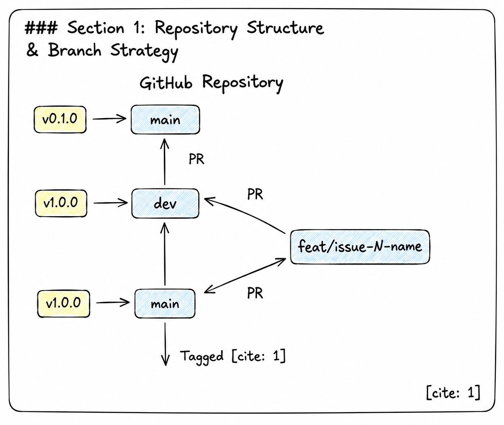
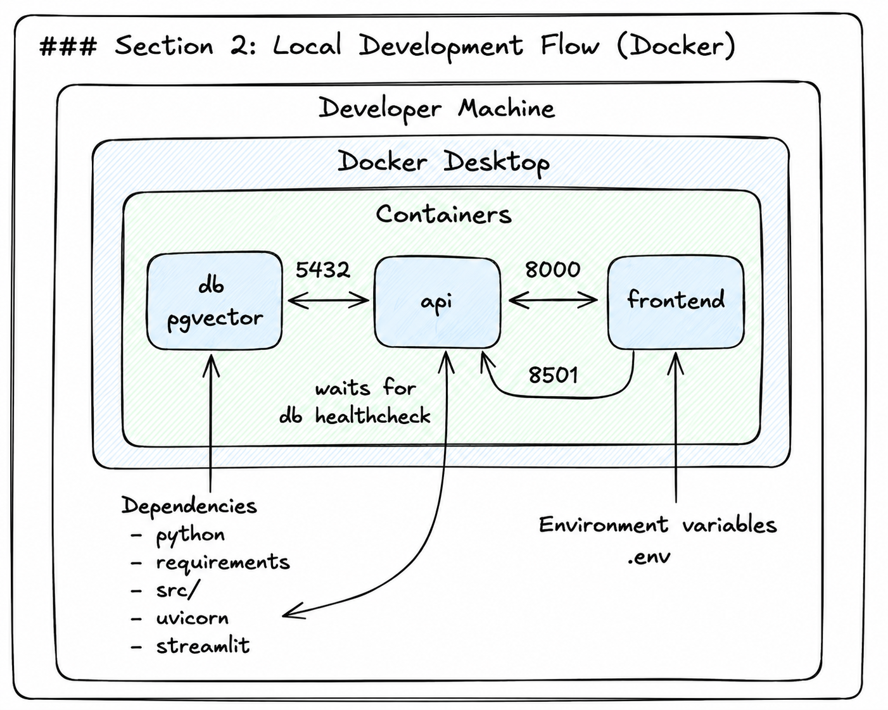
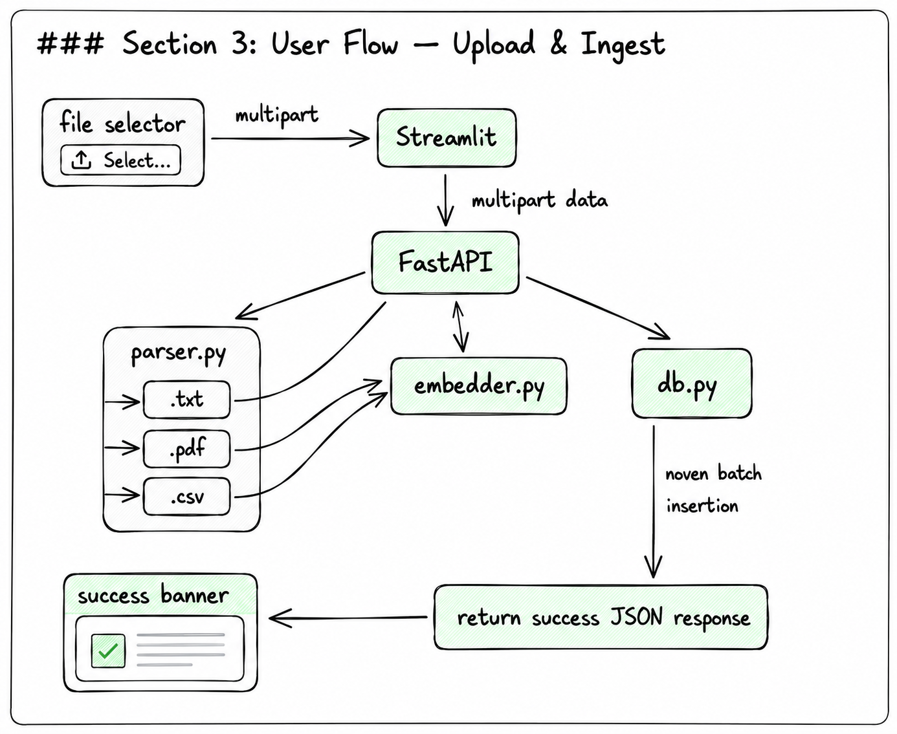
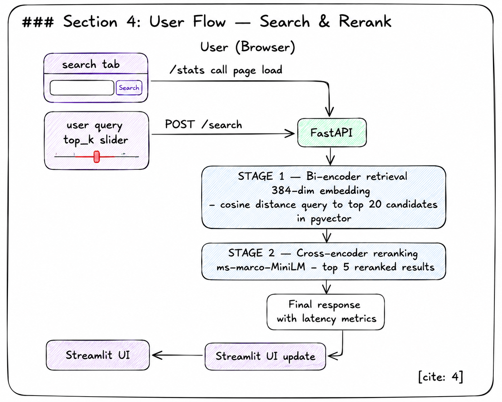
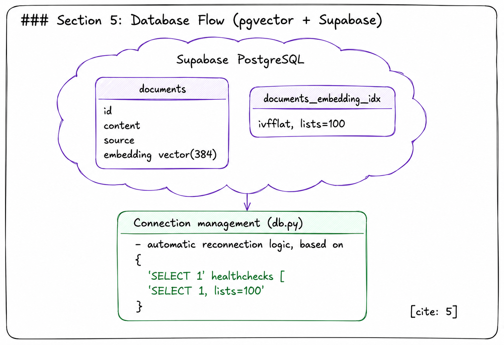
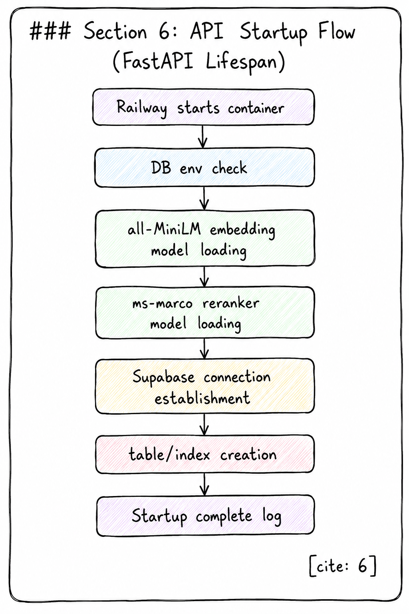
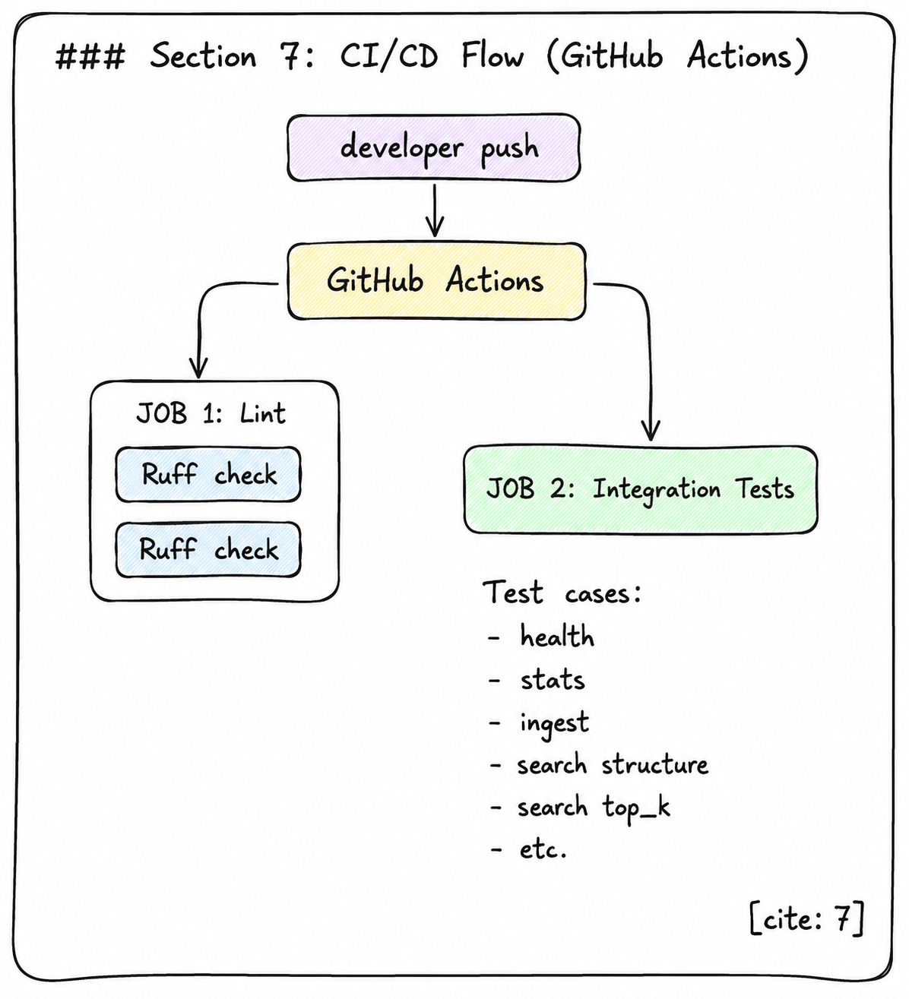
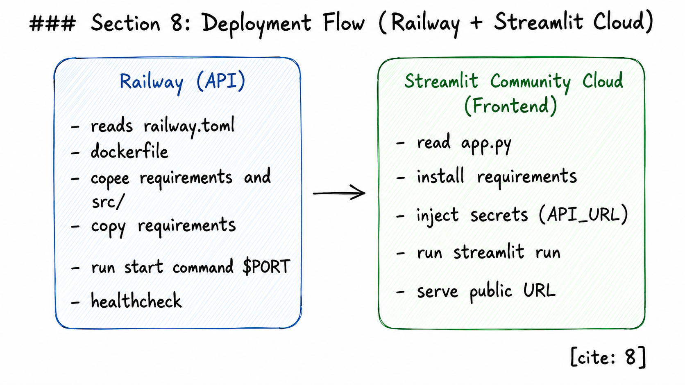
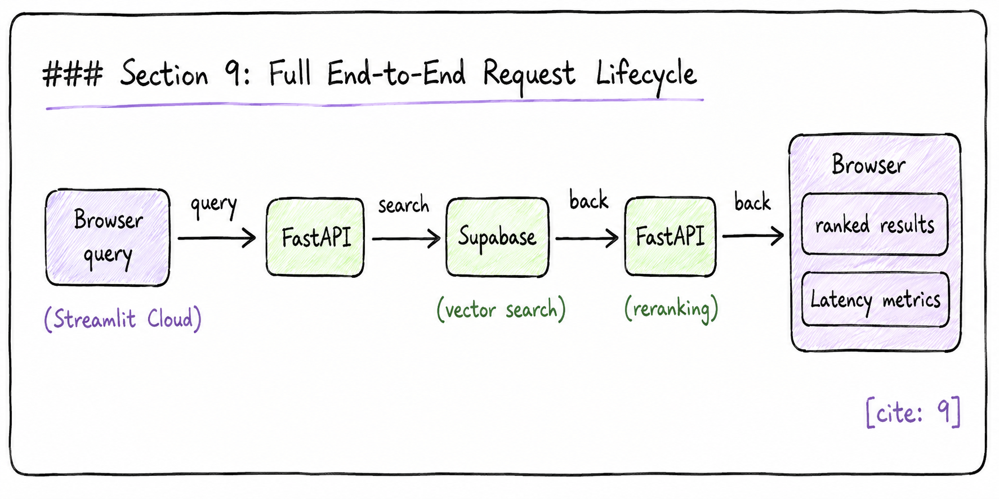

### Application screenshots
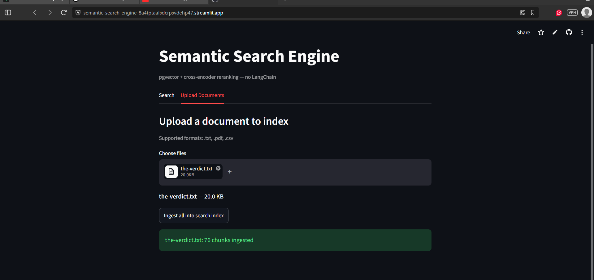
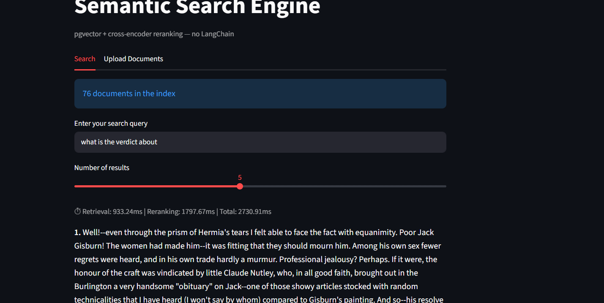